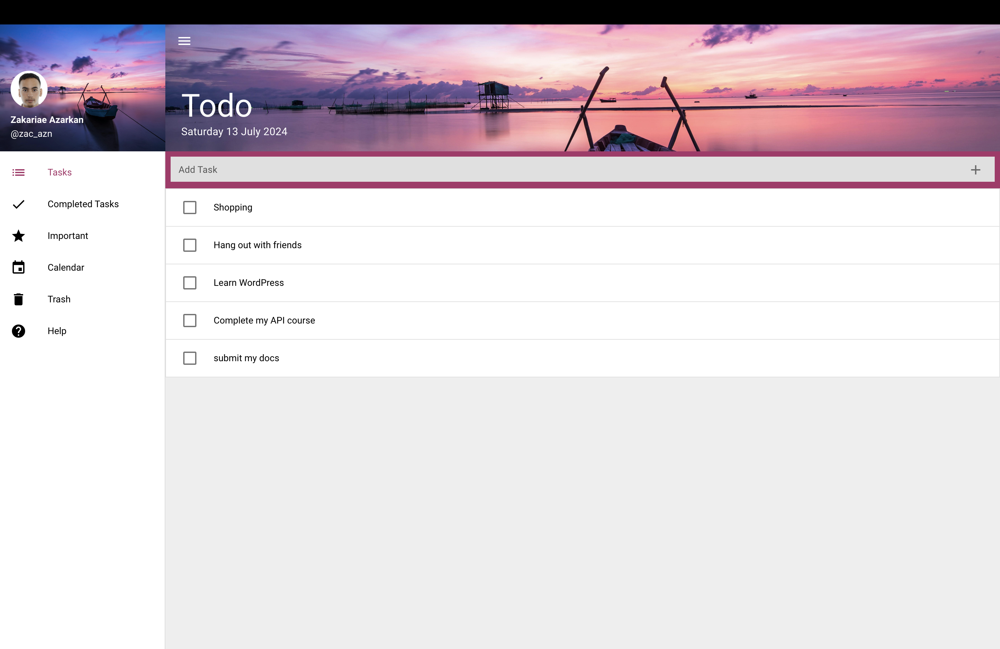
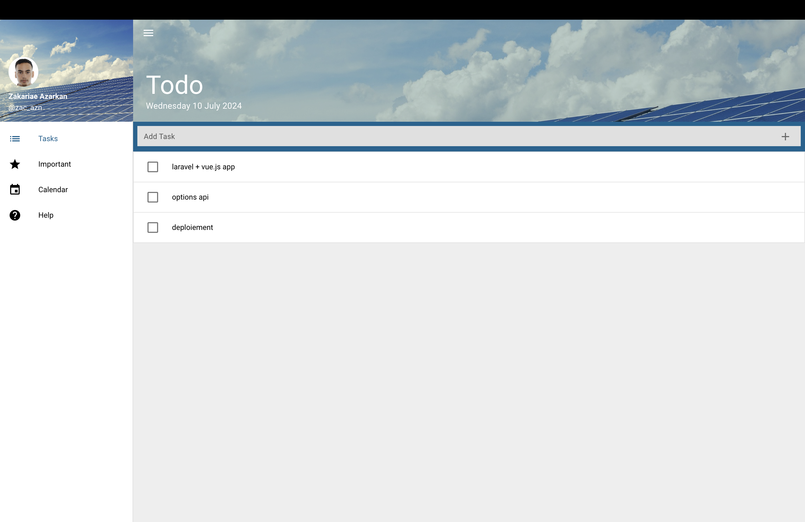

# Quasar To-Do List App

This is a simple and efficient To-Do List application built using the Quasar Framework. The app helps users manage their tasks effectively with a clean and intuitive interface.

## Features

- **Task Management**: Add, edit, and delete tasks.
- **Task Completion**: Mark tasks as completed with a single click.
- **Persistent Storage**: Save tasks locally so they persist between sessions.
- **Responsive Design**: Works seamlessly on both desktop and mobile devices.
- **User-Friendly Interface**: A clean and modern UI powered by Quasar components.
- **Cross-Platform Compatibility**: Developed with the ability to run on Windows, macOS, and Linux.

## Screenshots

## Technologies Used

- **Quasar Framework**: For building a high-performance Vue.js-based user interface.
- **Vue.js**: The progressive JavaScript framework for building user interfaces.
- **JavaScript**: The core language for the app's functionality.
- **HTML/CSS**: For structuring and styling the app.

## Getting Started

### Prerequisites

- Node.js
- NPM or Yarn

### Installation

1. Clone the repository:
   git clone https://github.com/yourusername/quasar-to-do-list-app.git
   cd quasar-to-do-list-app

2. Install the dependencies:
   npm install
   # or
   yarn install
3. Start the development server:
   quasar build #
