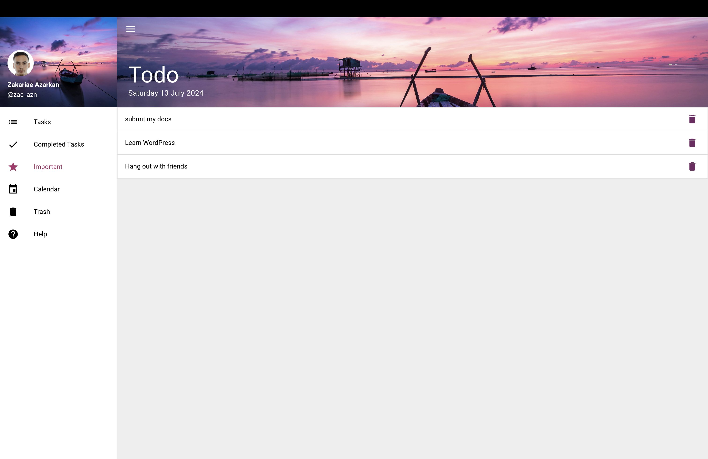
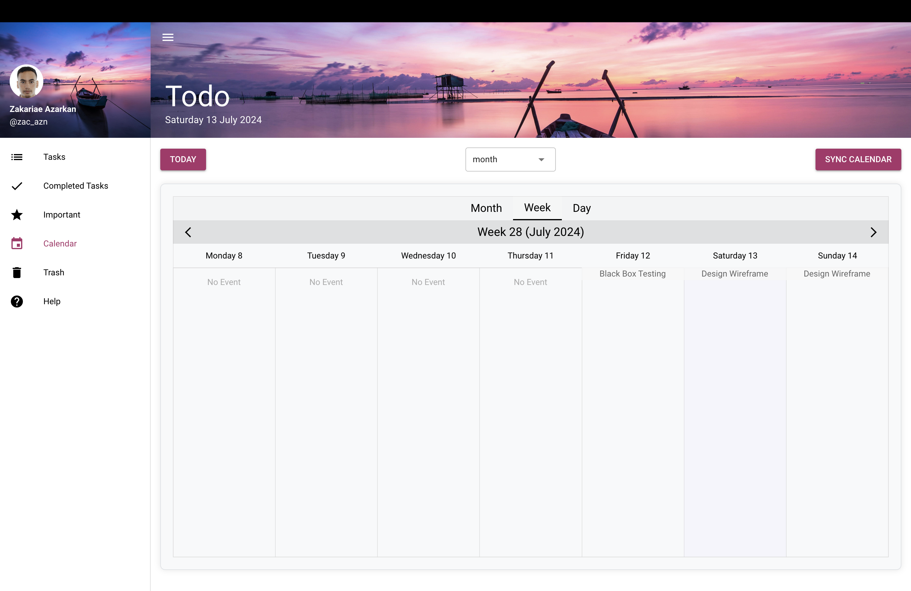
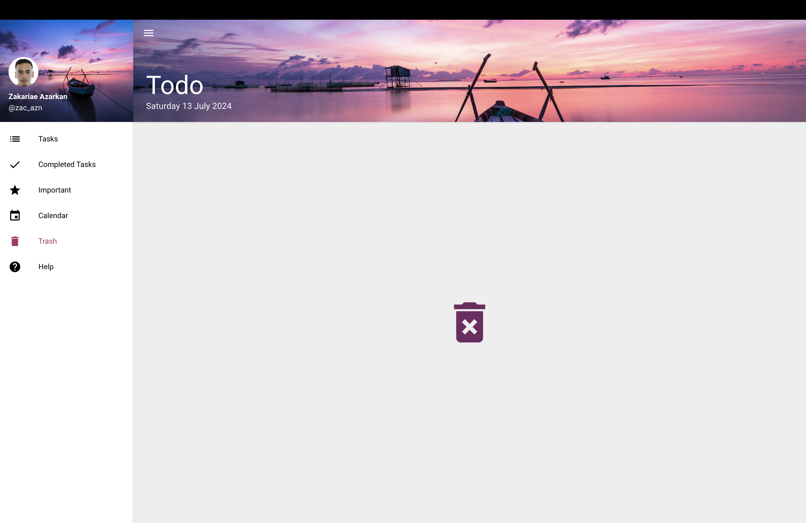
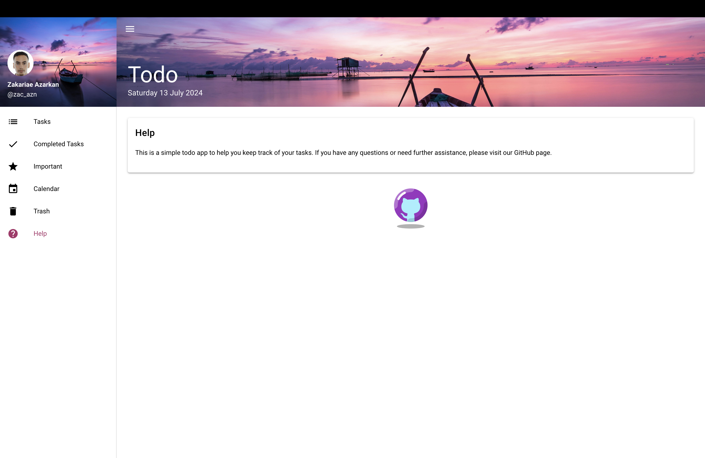

# Quasar To-Do List App

A Quasar Project

## Table of Contents
- [Introduction](#introduction)
- [Features](#features)
- [Screenshots](#screenshots)
- [Install the Dependencies](#install-the-dependencies)
- [Start the App in Development Mode](#start-the-app-in-development-mode)
- [Lint the Files](#lint-the-files)
- [Format the Files](#format-the-files)
- [Build the App for Production](#build-the-app-for-production)
- [Customize the Configuration](#customize-the-configuration)
- [License](#license)

## Introduction

This is a simple To-Do List application built using the Quasar Framework. The application allows users to manage their tasks, mark important tasks, view tasks on a calendar, and get help for using the app.

## Features

- Add, edit, and delete tasks
- Mark tasks as important
- View tasks on a calendar
- User-friendly interface
- Responsive design

## Screenshots







## Install the Dependencies

```bash
npm install
